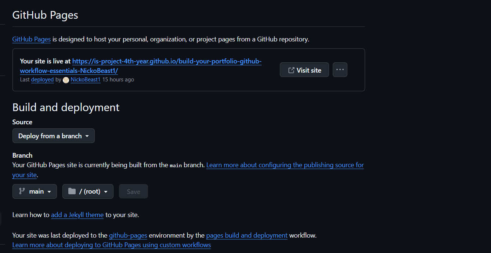
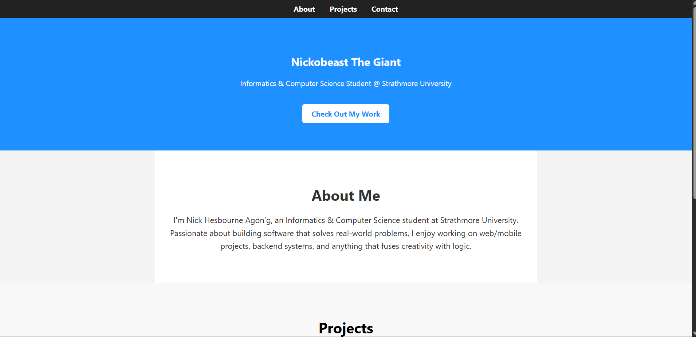
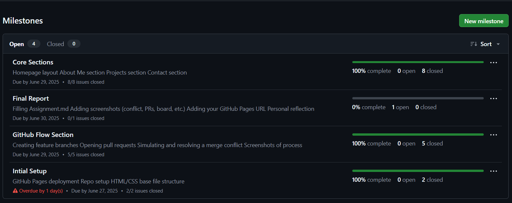
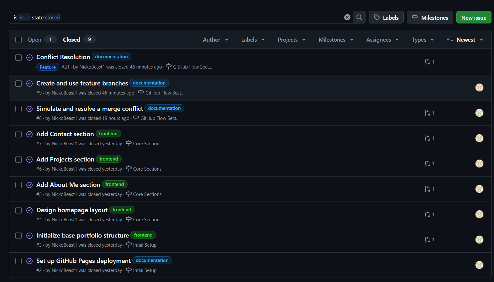
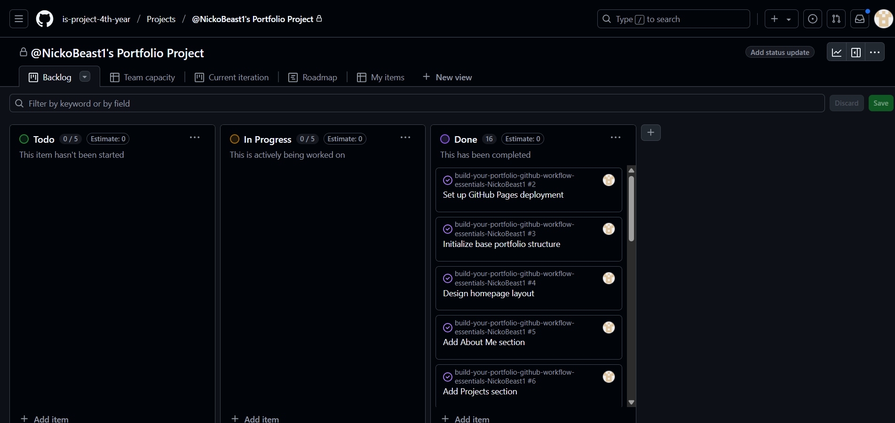
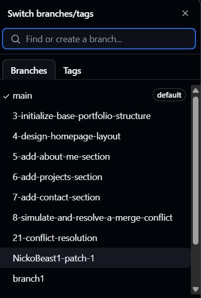
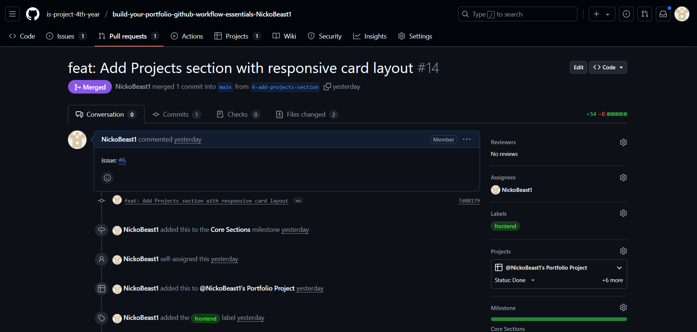
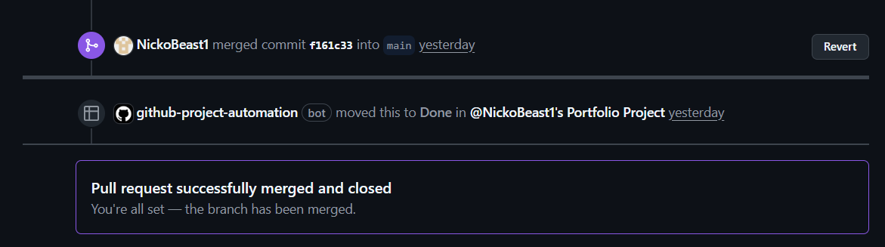
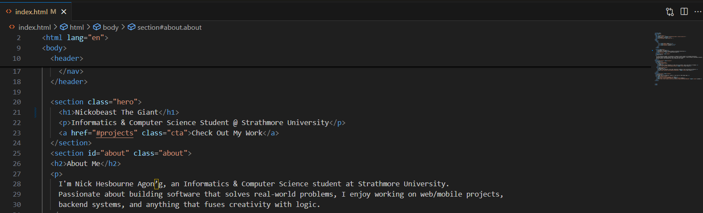

# Personal Portfolio Documentation

## 1. Student Details

- **Nick Hesbourne Agon'g**:
- **151952**:
- **NickoBeast1**:
- **nick.odhiambo@strathmore.edu**:

## 2. Deployed Portfolio Link

- **GitHub Pages URL**:  
  https://is-project-4th-year.github.io/build-your-portfolio-github-workflow-essentials-NickoBeast1/

## 3. Learnings from the Git Crash Program

## 🧠 What I Thought I'd Learn vs What I Actually Learned

---

### **1. Concept: Branching & Pull Requests**

**`Expectation`**: I assumed branches and pull requests were only needed in massive codebases with teams of developers. I expected to just push changes to `main` and be done.

**`Reality`**: Even as a solo dev, branching and PRs are essential! They gave me a clean workflow, let me organize features better, and made it easier to roll back mistakes.

**`Impact`**: I used a feature branch for each section of my portfolio — homepage, about, projects, contact and merged them using PRs.

---

### **2. Concept: Merge Conflicts**

**`Expectation`**: I thought merge conflicts were rare, scary, and only happened when teams accidentally overwrote each other’s work.

**`Reality`**: Turns out conflicts are easy to trigger and if you don't plan your branches well, they pop up even when you're working alone.

**`Impact`**: I simulated a merge conflict on purpose by editing the same line in two branches. It forced me to understand how to manually resolve conflicts and clean up the mess.

---

### **3. Concept: GitHub Pages**

**`Expectation`**: I thought deploying a website would involve servers, domain settings, or complex devops stuff I wasn’t ready for.

**`Reality`**: GitHub Pages was surprisingly beginner-friendly. A few clicks in the repo settings and boom site was live!

**`Impact`**: My portfolio went live instantly after merging to `main`. Seeing my code live on the internet with a real URL made it feel official.

---

### **4. Concept: Git Project Boards**

**`Expectation`**: I thought project boards were overkill for a small one-person project like this. I expected to keep things in my head or on sticky notes.

**`Reality`**: Using Issues, Milestones, and a Project Board made everything clearer. It felt like I was managing a real product with features and deadlines.

**`Impact`**: I broke my project into trackable tasks, moved them across “To Do → In Progress → Done,” and it kept me focused from start to finish.

---


## 4. Screenshots of Key GitHub Features

---

### Project Board


**Caption:** This shows the GitHub Project Board with columns for “To do”, “In progress”, and “Done.” Each issue was linked to the board for visual tracking of the development workflow.

---

### Pull Request with Rebase & Merge


**Caption:** This screenshot demonstrates how I used a pull request to merge a feature branch into `main` using the “Rebase and merge” strategy to keep a clean and linear commit history.

---

###  Merge Conflict Alert


**Caption:** GitHub warning me about a merge conflict after attempting to merge two branches that edited the same line of code. This was part of the conflict simulation exercise.

---

###  Merge Conflict Resolution


**Caption:** This shows GitHub’s conflict editor interface where I manually resolved the conflict by selecting and cleaning the code before committing the fix.

---

###  GitHub Pages Deployment



**Caption:** Configuration of GitHub Pages from the `main` branch and root directory. This setup made my portfolio site live and accessible on the web.

---

###  Live Portfolio Preview



**Caption:** Final deployed site showing my live portfolio with all four sections fully implemented: Hero, About Me, Projects, and Contact.


```

### A. Milestones and Issues




### B. Project Board



### C. Branching



### D. Pull Requests




### E. Merge Conflict Resolution



